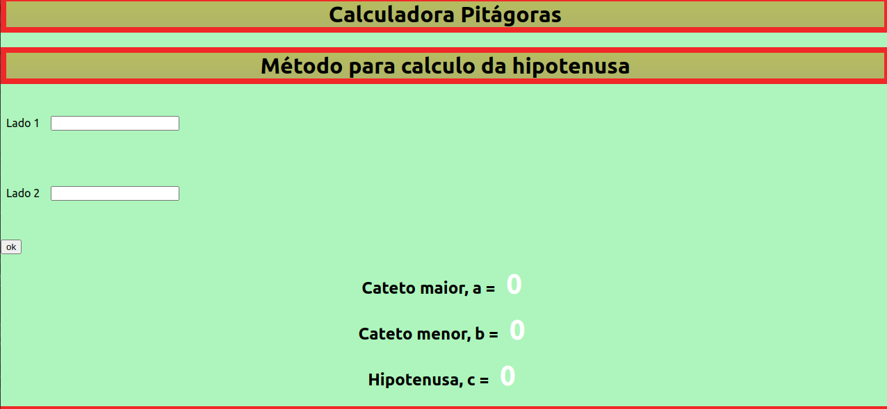

# calculadora-react

## [Confira o resultado](https://calculadora-react-ederreis.herokuapp.com/)
> Aplicação para calcular relação de lados de triângulos retângulos, ora com a finalidade de obter valor da hipotenusa, ora com a finalidade de obter o valor de um dos catetos. Com conexão com a [API](https:https://api-pitagoras-ederreis.herokuapp.com/) para obter relação via API-Flask.



## Repositório da API-Flask
> O end-point para fornecimento dados utilizando linguagem ```python```, com o framework ```Flask```
<https://github.com/EderReisS/API_CALCULAR_HIPOTENUSA>

## 🚀 Contribuições

1. Faça o _fork_ do projeto (<https://github.com/EderReisS/calculadora-react/fork>)
2. Crie uma _branch_ para sua modificação (`git checkout -b feature/fooBar`)
3. Faça o _commit_ (`git commit -am 'Add some fooBar'`)
4. _Push_ (`git push origin feature/fooBar`)
5. Crie um novo _Pull Request_

#### Atualização do deploy na plataforma heroku
 ```git push heroku main```
